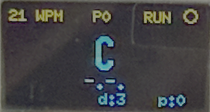
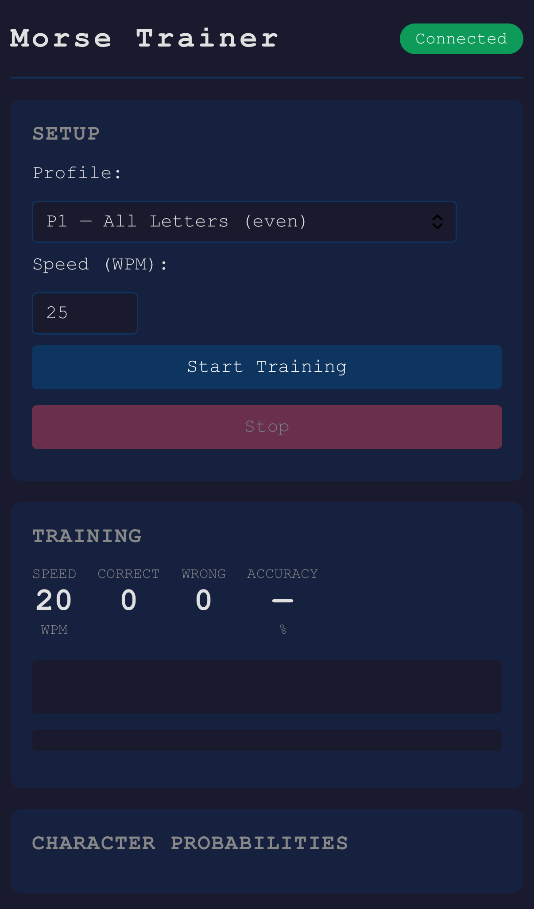
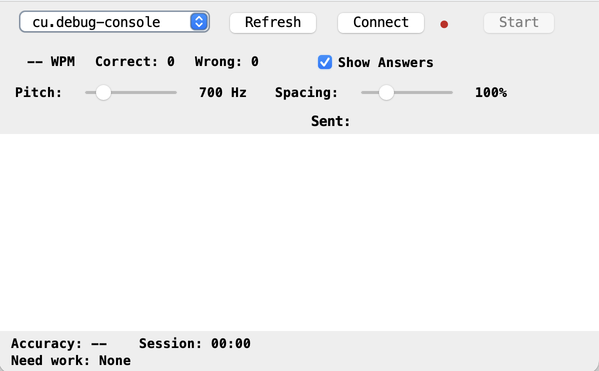

# ESP8266 Morse Trainer

An adaptive Morse code trainer for the ESP8266 (NodeMCU). It sends random characters as audible Morse code, accepts your typed responses, and dynamically adjusts which characters appear and how fast they're sent based on your accuracy.

Ported from [SensorsIot/Morse-Trainer](https://github.com/SensorsIot/Morse-Trainer) (Arduino) to ESP8266 with a web UI and serial interface.

## Hardware

### Supported Boards

| Board | PlatformIO env | Arduino IDE define | Notes |
|-------|---------------|-------------------|-------|
| NodeMCU v2 (ESP-12E) | `nodemcuv2` (default) | None needed | External peripherals, optional OLED |
| ESP8266 0.96" OLED module v2.1.0 | `esp8266_oled` | `#define BOARD_ESP8266_OLED` | Built-in SSD1306 128x64 OLED |

Both boards use the same ESP-12E chip and flash layout. Pin differences are handled in `config.h`.

### Required

- **NodeMCU v2** or **ESP8266 OLED module** (see table above)
- USB cable for flashing and serial

### Optional

- **Passive buzzer** — GPIO4/D2 (NodeMCU) or GPIO12/D6 (OLED module) — not needed if using the desktop client, which plays sidetone through your computer's speakers
- **LED** — GPIO5/D1 (NodeMCU) or GPIO14/D5 (OLED module) — visual morse signal
- **OLED display** — SSD1306 (128x64 or 128x32) or SH1106 (128x64), I2C (NodeMCU only; built-in on OLED module)
- **Morse key** — straight key or iambic paddle for keying practice
- The on-board LED (GPIO2/D4) is used as a status indicator on both boards

### NodeMCU v2 Pin Map

| GPIO | NodeMCU | Function | Notes |
|------|---------|----------|-------|
| 4 | D2 | Buzzer (PWM) | Optional |
| 5 | D1 | Morse LED | Optional |
| 2 | D4 | Status LED | On-board, active LOW |
| 12 | D6 | OLED SDA (I2C) | Optional |
| 14 | D5 | OLED SCL (I2C) | Optional |
| 13 | D7 | Morse key / dit paddle | Optional, active LOW, internal pullup |
| 0 | D3 | Dah paddle (iambic only) | Optional, active LOW, **do not hold during boot** |

Free pins: GPIO16 (D0), GPIO15 (D8).

### ESP8266 OLED Module Pin Map

The built-in OLED uses GPIO14 (SDA) / GPIO12 (SCL), which are the same pins NodeMCU uses for its external OLED. The buzzer and LED use GPIO4/GPIO5:

| GPIO | NodeMCU | Function | Notes |
|------|---------|----------|-------|
| 14 | D5 | OLED SDA (built-in) | I2C data |
| 12 | D6 | OLED SCL (built-in) | I2C clock |
| 4 | D2 | Buzzer (PWM) | Optional |
| 5 | D1 | Morse LED | Optional |
| 2 | D4 | Status LED | On-board, active LOW |
| 13 | D7 | Morse key / dit paddle | Optional, active LOW, internal pullup |
| 0 | D3 | Dah paddle (iambic only) | Optional, active LOW, **do not hold during boot** |

### Basic Wiring (buzzer + LED)

```
NodeMCU          Component
-------          ---------
D2 (GPIO4) ----> Passive Buzzer (+)
GND        ----> Passive Buzzer (-)
D1 (GPIO5) ----> LED anode (with 220-470 ohm resistor to GND)
```

### OLED Display Wiring

The default ESP8266 I2C pins (GPIO4/5) are taken by the buzzer and LED, so I2C is remapped to D6/D5. All three supported display types use the same four wires:

```
NodeMCU          OLED Module
-------          -----------
D6 (GPIO12) ---> SDA
D5 (GPIO14) ---> SCL
3V3         ---> VCC
GND         ---> GND
```

Most SSD1306/SH1106 breakout boards have the I2C address set to 0x3C by default. If your board uses 0x3D, you'll need to change the U8g2 constructor in `oled_display.cpp` (see [Customizing the Display](#customizing-the-display) below).

#### Choosing Your Display Type

Edit `include/config.h` and uncomment **one** display type:

```cpp
// Uncomment ONE display type:
#define OLED_SSD1306_128X64        // most common — 0.96" displays
// #define OLED_SSD1306_128X32     // smaller 0.91" half-height displays
// #define OLED_SH1106_128X64      // 1.3" displays (often mislabeled as SSD1306)
```

Rebuild after changing. If you're not sure which controller your display uses, try SSD1306 first — if the display shows garbled pixels or is shifted horizontally by a few pixels, it's probably an SH1106.

#### Display Layouts

128x64 (SSD1306 or SH1106):

```
+----------------------------+
| 25 WPM    P1      O  RUN   |  speed, profile, tone indicator, status
|                            |
|           A                |  current character (large)
|          .-                |  morse pattern
|                            |
| OK          d:2      p:45  |  result, queue distance, probability
+----------------------------+
```

128x32 (compact):

```
+----------------------------+
| 25W P1   A  .-             |  speed, profile, char, pattern
| OK       d:2 p:45       O  |  result, distance, prob, tone dot
+----------------------------+
```

The tone indicator is a filled circle while a tone is playing, a hollow circle when idle/running, and absent when stopped.

#### Running Without a Display

If no OLED display type is defined (all three lines commented out), the display code compiles to empty stubs — zero overhead. If a display type is defined but no physical display is wired, the trainer still works normally; the I2C writes just go nowhere.

### Morse Key Wiring

#### Straight Key

A straight key (or any momentary-contact switch) connects between D7 and GND. The internal pullup keeps the pin HIGH when idle; closing the key pulls it LOW.

```
NodeMCU          Straight Key
-------          ------------
D7 (GPIO13) ---> one terminal
GND         ---> other terminal
```

That's it — no external resistor needed.

#### Iambic Paddle

An iambic paddle has two independent contacts — dit and dah. Both connect to GND:

```
NodeMCU          Iambic Paddle
-------          -------------
D7 (GPIO13) ---> dit contact (dots)
D3 (GPIO0)  ---> dah contact (dashes)
GND         ---> common ground
```

> **Boot gotcha**: GPIO0 (D3) is the ESP8266's flash/boot mode select pin. If D3 is held LOW during power-on or reset, the ESP8266 enters flash mode and won't run your firmware. This means: **do not hold the dah paddle closed while powering on or pressing the reset button.** During normal operation after boot, D3 works fine as an input.

#### Choosing Key Mode

Edit `include/config.h`:

```cpp
// Straight key — uses D7 only:
#define KEY_MODE  KEY_MODE_STRAIGHT

// Iambic paddle — uses D7 (dit) + D3 (dah):
// #define KEY_MODE  KEY_MODE_IAMBIC
```

Rebuild after changing.

#### How Key Input Works

The key decoder is purely polled in `loop()` — no interrupts. The main loop runs fast enough (~1ms) that even at 200 WPM (6ms dit) there's no missed input.

**Timing** (both modes) is derived from the trainer's current speed:

| Element | Duration |
|---------|----------|
| Dit | `1200 / WPM` ms |
| Dah | `3 * dit` |
| Element gap | `1 * dit` |
| Character gap | `3 * dit` (triggers decode) |
| Word gap | `7 * dit` (sends space) |

**Straight key**: Press duration less than `2 * dit` = dot, longer = dash. Elements accumulate into a pattern. After `3 * dit` of silence the pattern is decoded to a character and submitted to the trainer. After `7 * dit` of silence a word space is submitted.

**Iambic Mode B**: Closing the dit paddle produces automatically-timed dots. Closing the dah paddle produces dashes. Squeezing both paddles together produces alternating dit-dah-dit-dah. On release, the current element finishes before stopping (Mode B behavior). After `3 * dit` idle, the accumulated pattern decodes and submits.

Both modes produce sidetone through the buzzer while keying, so you hear what you're sending.

#### Running Without a Key

If no key is connected, the internal pullups keep the pins HIGH — no spurious input. The trainer works normally with serial and/or web input only.

## Computer Setup

### USB Driver

Most NodeMCU boards use a **CH340** or **CP2102** USB-to-serial chip. You may need to install a driver:

- **macOS**: CH340 driver — download from https://github.com/adrianmihalko/ch340g-ch34g-ch34x-mac-os-x-driver (macOS 12+ usually works without it). CP2102 — download from https://www.silabs.com/developers/usb-to-uart-bridge-vcp-drivers
- **Windows**: CH340 — download from https://sparks.gogo.co.nz/ch340.html. CP2102 — download from https://www.silabs.com/developers/usb-to-uart-bridge-vcp-drivers
- **Linux**: Both drivers are built into the kernel. No install needed.

### Finding Your Serial Port

Plug in the NodeMCU via USB, then:

- **macOS**: `ls /dev/cu.usbserial-*` or `ls /dev/cu.wchusbserial-*`
- **Linux**: `ls /dev/ttyUSB*` or `ls /dev/ttyACM*`
- **Windows**: Open Device Manager, look under "Ports (COM & LPT)" for the COM port number

If nothing shows up, the driver isn't installed or the USB cable is charge-only (no data lines). Try a different cable.

## Flashing the Firmware

### Windows Quick Flash

If you're on Windows and just want to flash and go:

1. Install [Python 3.8+](https://www.python.org/downloads/) (check "Add python.exe to PATH")
2. Plug in the ESP8266 via USB
3. Double-click `tools/flash_firmware.bat`
4. Choose your board, wait for flash, press the reset button

The script installs PlatformIO automatically, detects the serial port, and flashes both firmware and web UI filesystem.

### Flashing Pre-built Binaries

Pre-compiled binaries are in the `bin/` folder. You can flash them without building from source using either the Espressif Flash Download Tool (GUI, Windows) or esptool.py (command line, any OS).

#### Flash addresses

| File | Address | Contents |
|------|---------|----------|
| `bin/firmware.bin` | `0x0` | Firmware |
| `bin/littlefs.bin` | `0x200000` | Web UI filesystem |

Both files are needed on first flash.

#### Espressif Flash Download Tool (Windows GUI)

1. Download from https://www.espressif.com/en/support/download/other-tools
2. Run `flash_download_tool_x.x.x.exe`, select **ESP8266** and **Develop**
3. Configure:
   - Add `bin/firmware.bin` at address `0x0` — check the box to enable
   - Add `bin/littlefs.bin` at address `0x200000` — check the box to enable
   - **SPI Speed**: 40MHz
   - **SPI Mode**: DIO
   - **Flash Size**: 32Mbit (4MB)
   - **COM port**: select your port (check Device Manager for the COM number)
   - **Baud**: 460800
4. Click **START**
5. When done, press the **RESET** button on the board

#### esptool.py (command line)

```bash
pip install esptool
```

Connect the board via USB, find the serial port (`/dev/ttyUSB0` on Linux, `/dev/cu.usbserial-*` on macOS, `COM3` etc. on Windows), then:

```bash
# Flash both in one command
esptool.py --port /dev/ttyUSB0 --baud 460800 write_flash 0x0 bin/firmware.bin 0x200000 bin/littlefs.bin
```

Press the **RESET** button on the board after flashing.

## Building from Source — Arduino IDE

The `MorseTrainer/` folder is a self-contained Arduino sketch. On macOS and Linux it uses symlinks back to the main `src/`, `include/`, and `data/` directories, so everything stays in sync automatically.

### Windows: Sync files first

On Windows, git clones the symlinks as plain text files instead of real links (unless you have Developer Mode enabled with `git config core.symlinks true`). You need to copy the real source files into `MorseTrainer/` before opening the sketch.

**Option A** — Double-click `sync_arduino.bat` in the project root (or run it from a terminal).

**Option B** — Run the Python script directly:

```
python sync_arduino.py
```

**Option C** — Use the flash tool, which syncs automatically before building:

```
tools\flash_firmware.bat
```

> `flash_firmware.bat` runs `sync_arduino.py`, installs PlatformIO if needed, builds, and flashes both firmware and filesystem in one step. If you use it, you can skip the rest of this section.

Re-run `sync_arduino.py` any time you pull new changes from GitHub.

### 1. Install Arduino IDE

Download from https://www.arduino.cc/en/software (version 2.x recommended).

### 2. Add ESP8266 board support

1. Open **File > Preferences**
2. In **Additional Board Manager URLs**, add:
   ```
   https://arduino.esp8266.com/stable/package_esp8266com_index.json
   ```
3. Open **Tools > Board > Boards Manager**, search for **esp8266**, and install **ESP8266 by ESP8266 Community**

### 3. Install required libraries

Open **Sketch > Include Library > Manage Libraries** and install:

- **ArduinoJson** by Benoit Blanchon
- **ESPAsyncTCP** by dvarrel
- **ESPAsyncWebServer** by lacamera
- **U8g2** by oliver (OLED display support)

### 4. Open the sketch

Open `MorseTrainer/MorseTrainer.ino` in Arduino IDE.

#### Board selection (Arduino IDE)

The default build targets NodeMCU v2. To build for the ESP8266 OLED module, edit `MorseTrainer/config.h` and uncomment the board define:

```cpp
// #define BOARD_NODEMCU           // NodeMCU v2 with external peripherals
#define BOARD_ESP8266_OLED      // ESP8266 0.96" OLED module v2.1.0
```

### 5. Configure board settings

Under **Tools**, set:

| Setting | Value |
|---|---|
| Board | NodeMCU 1.0 (ESP-12E Module) |
| Flash Size | 4MB (FS:2MB OTA:~1019KB) |
| Upload Speed | 115200 |
| Port | *(your serial port)* |

### 6. Upload firmware

Click the **Upload** button (arrow icon) or **Sketch > Upload**.

### 7. Upload LittleFS data

The web UI files in `MorseTrainer/data/` need to be uploaded to the ESP8266's filesystem separately.

Install the LittleFS upload plugin for Arduino IDE 2.x:
https://github.com/earlephilhower/arduino-littlefs-upload

Then press **Ctrl+Shift+P** (or **Cmd+Shift+P** on macOS), type **Upload LittleFS**, and select it.

## Building from Source — PlatformIO (alternative)

### Prerequisites

- [PlatformIO CLI](https://platformio.org/install/cli) or [PlatformIO IDE](https://platformio.org/install/ide) (VS Code extension)

Install PlatformIO CLI if you don't have it:

```bash
pip install platformio
```

### Build

```bash
pio run                       # builds all environments (NodeMCU + OLED module)
pio run -e nodemcuv2          # build for NodeMCU v2 only
pio run -e esp8266_oled       # build for ESP8266 OLED module only
```

### Flash firmware + filesystem

Connect the board via USB, then:

```bash
pio run -e nodemcuv2 --target upload      # flash firmware (NodeMCU)
pio run -e nodemcuv2 --target uploadfs    # flash web UI files to LittleFS

pio run -e esp8266_oled --target upload   # flash firmware (OLED module)
pio run -e esp8266_oled --target uploadfs # flash web UI files to LittleFS
```

> **Note**: After flashing the filesystem (`uploadfs`), press the **reset button** on the board. The ESP8266 does not automatically reboot after a filesystem flash.

### Serial monitor

```bash
pio device monitor
```

## Usage

There are two ways to interact with the trainer: **serial** and **web UI**. Both work simultaneously.

### Serial Interface

Connect at **115200 baud**. Commands:

| Command | Description |
|---|---|
| `/start [profile] [speed]` | Start training (e.g. `/start 1 25`) |
| `/stop` | Stop training and save probabilities |
| `/speed N` | Set speed to N WPM (20-200) |
| `/profile N` | Switch profile (0-9) |
| `/status` | Show current state |
| `/probs` | Show character probabilities |
| `/help` | Show all commands |
| `/wifi [ap\|sta] [ssid] [pass]` | Configure WiFi mode |

During training, just type characters to respond — no Enter needed.

### Web UI


1. Connect to the **MorseTrainer** WiFi network (password: `morsecode`)
2. Open a browser to **http://192.168.4.1** (or http://morse.local if mDNS works on your OS)
3. Select a profile and speed, click **Start**
4. Listen to the tones from the buzzer and type what you hear

The web UI has:
- Profile and speed selection
- **Pitch slider** — adjusts the buzzer tone frequency (300–1200 Hz, default 700 Hz)
- On-screen QWERTY keyboard with number/punctuation layer toggle
- Border flash feedback (green = correct, red = wrong)

### Desktop Client (Java)


A standalone desktop app that connects over USB serial for near-zero latency input and audio feedback — no WiFi needed.

#### Requirements

- Java 11+ ([Adoptium](https://adoptium.net))
- USB cable to the ESP8266

#### Running

```bash
cd tools/MorseClient
java -jar MorseClient.jar
```

Or double-click `run.bat` (Windows) / `run.sh` (Mac/Linux).

#### Features

- **Port selector** — dropdown with Refresh, auto-detects serial ports
- **Connect/Disconnect** — opens the serial port at 115200 baud; queries `/status` on connect to sync with a running session
- **Start/Stop** — sends `/start` and `/stop` commands
- **Keyboard capture** — the whole window captures keystrokes; typed characters are sent as single bytes over serial (no Enter needed)
- **Audio sidetone** — plays morse tones through laptop speakers when `[TX]` events arrive, with proper dit/dah timing from WPM
- **Pitch slider** — 300–2400 Hz (default 700 Hz)
- **Spacing slider** — 25–300% of standard inter-element gap
- **Show Answers checkbox** — when unchecked, hides TX lines and the sent chars display so you must decode by ear only
- **Color-coded result feed** — green for correct, red for errors, newest entries at top
- **Live stats** — WPM, correct/wrong counts, accuracy %, session timer, weakest characters
- **CSV export** — session log saved automatically on exit

#### Building from Source

```bash
cd tools/MorseClient
./gradlew jar        # produces build/libs/MorseClient.jar (fat JAR, ~877K)
./gradlew run        # build and run in one step
```

### Profiles

| Profile | Description |
|---|---|
| P0 | Saved — loads your last session's adapted probabilities |
| P1 | All letters A-Z, evenly weighted |
| P2 | Letters weighted by German text frequency (fixed — won't adapt) |
| P3 | Numbers 0-9 only |
| P4 | Punctuation marks only |
| P5 | Letters + punctuation |
| P6 | Beginner 1 — A, E, M, N, T (5 chars) |
| P7 | Beginner 2 — A, E, G, I, K, M, N, O, R, T (10 chars) |
| P8 | Beginner 3 — 15 common characters |
| P9 | Beginner 4 — 20 characters |

### How the Training Works

- Characters are sent in groups of 5, separated by word spaces
- **Get it right**: that character's probability decreases (appears less often)
- **Get it wrong**: both the typed and expected character probabilities increase (appear more often)
- Every 10 characters, speed is evaluated:
  - 0 errors: speed increases by 2 WPM
  - 2+ errors: speed decreases by 4 WPM
  - 1 error: no change
- If you fall 5+ characters behind, the trainer pauses and slows down
- Probabilities are saved to flash when you stop, so progress persists across reboots

## Project Structure

```
cw/
├── platformio.ini              # Build configuration
├── sync_arduino.bat            # Double-click wrapper for sync_arduino.py (Windows)
├── sync_arduino.py             # Copies src/include/data into MorseTrainer/ (Windows symlink fix)
├── README.md                   # This file
├── docs/
│   └── ORIGINAL_ANALYSIS.md    # Detailed analysis of the original Arduino code
├── include/                    # Header files
│   ├── config.h                # Pins, constants, defaults, display/key selection
│   ├── buzzer.h                # PWM tone generation
│   ├── morse_engine.h          # Morse encoding + transmission FSM
│   ├── morse_key.h             # Physical morse key/paddle input
│   ├── oled_display.h          # OLED display output
│   ├── profiles.h              # P1-P9 probability profiles
│   ├── storage.h               # LittleFS persistence
│   ├── trainer.h               # Adaptive training logic
│   ├── serial_interface.h      # Serial I/O
│   └── web_server.h            # WiFi + HTTP + WebSocket
├── src/                        # Implementation
│   ├── main.cpp                # setup(), loop(), integration
│   ├── buzzer.cpp
│   ├── morse_engine.cpp
│   ├── morse_key.cpp           # Key polling, timing, pattern decode
│   ├── oled_display.cpp        # U8g2 display driver + layout rendering
│   ├── profiles.cpp
│   ├── storage.cpp
│   ├── trainer.cpp
│   ├── serial_interface.cpp
│   └── web_server.cpp
├── data/                       # Web UI (uploaded to LittleFS)
│   ├── index.html
│   ├── style.css
│   └── app.js
└── tools/                      # Desktop tools
    ├── README.txt              # Quick start guide for new users
    ├── flash_firmware.bat      # Windows: one-click firmware flash
    └── MorseClient/            # Java serial client
        ├── MorseClient.jar     # Fat JAR (run with java -jar)
        ├── run.bat             # Windows launcher
        ├── run.sh              # Mac/Linux launcher
        ├── build.gradle        # Gradle build (for development)
        └── src/main/java/morsetrainer/
            ├── MorseClient.java       # Swing UI, keyboard dispatch
            ├── SerialConnection.java  # jSerialComm wrapper, protocol parser
            ├── SessionLog.java        # Per-character stats, CSV export
            └── ToneGenerator.java     # Audio sidetone (sine wave)
```

## Customizing the Display

The display rendering lives in `src/oled_display.cpp`. The code uses the [U8g2 library](https://github.com/olikraus/u8g2/wiki), which provides a drawing API on top of a framebuffer. The pattern is: receive trainer events into cached state variables, then redraw the full screen from those variables when `update()` is called.

### Architecture

```
TrainerEvent ──> onTrainerEvent()  ──> updates static state (dSpeed, dChar, etc.)
                                       sets dirty = true

MorseElement ──> onMorseElement()  ──> updates dToneOn
                                       sets dirty = true

loop() ────────> update()          ──> if dirty && throttle elapsed:
                                         clearBuffer()
                                         drawScreen64() or drawScreen32()
                                         sendBuffer()
```

Redraws are throttled to every 80ms (`REDRAW_INTERVAL`) to avoid spending too much time on I2C. The display only redraws when something has changed (`dirty` flag).

### Adding New Information to the Display

The `TrainerEvent` struct (defined in `trainer.h`) carries all the data. The display caches what it needs in static variables at the top of `oled_display.cpp`. To display something new, you:

1. Cache the value from the event
2. Draw it in the render function

**Example: show an error counter on the 128x64 display**

In `oled_display.cpp`, add a counter variable alongside the other cached state:

```cpp
static int dErrorCount = 0;
```

Update it in `onTrainerEvent()`, inside the `RESULT` case:

```cpp
case TrainerEvent::RESULT:
    dResultValid = true;
    dCorrect = evt.correct;
    dTypedChar = evt.typedChar;
    dExpectedChar = evt.expectedChar;
    dProb = evt.prob;
    if (!evt.correct) dErrorCount++;    // <-- add this
    break;
```

Reset it when a session starts, inside the `SESSION_STATE` case:

```cpp
case TrainerEvent::SESSION_STATE:
    dRunning = evt.running;
    dSpeed = evt.speed;
    if (evt.running) {
        dResultValid = false;
        dChar = ' ';
        dPattern[0] = '\0';
        dErrorCount = 0;               // <-- add this
    }
    break;
```

Draw it in `drawScreen64()`:

```cpp
// After the existing status line at the top:
snprintf(buf, sizeof(buf), "err:%d", dErrorCount);
u8g2.drawStr(40, 63, buf);
```

Rebuild and flash — the error count will appear in the bottom status line.

### Changing Fonts

U8g2 has hundreds of built-in fonts. Each `setFont()` call changes the font for all subsequent `drawStr()` / `drawGlyph()` calls until the next `setFont()`. The current code uses three:

| Font | Size | Used for |
|------|------|----------|
| `u8g2_font_6x10_tf` | 6x10 px | Status line, results |
| `u8g2_font_7x13_tf` | 7x13 px | Morse pattern |
| `u8g2_font_logisoso22_tf` | ~22 px tall | Current character (large, 128x64 only) |

To make the character even larger on a 128x64 display, swap the font:

```cpp
// In drawScreen64(), change:
u8g2.setFont(u8g2_font_logisoso22_tf);

// To:
u8g2.setFont(u8g2_font_logisoso28_tf);
```

You'll need to adjust the Y position too (larger fonts need more vertical space). The full font list is at: https://github.com/olikraus/u8g2/wiki/fntlistall

### Drawing Primitives

U8g2 provides a full graphics API you can use in the draw functions. Some useful calls:

```cpp
// Text
u8g2.drawStr(x, y, "text");                // draw string at x,y (y = baseline)
int w = u8g2.getStrWidth("text");           // measure string width in pixels

// Shapes
u8g2.drawLine(x0, y0, x1, y1);             // line between two points
u8g2.drawFrame(x, y, w, h);                // hollow rectangle
u8g2.drawBox(x, y, w, h);                  // filled rectangle
u8g2.drawCircle(x, y, r);                  // hollow circle
u8g2.drawDisc(x, y, r);                    // filled circle

// Pixel
u8g2.drawPixel(x, y);                      // single pixel

// Bitmaps
u8g2.drawXBM(x, y, w, h, bitmap_data);     // XBM bitmap
```

Coordinates: (0,0) is top-left. For text, Y is the **baseline** (bottom of the letters, not the top). A 10px-tall font drawn at Y=10 puts the text at the very top of the screen.

### Example: Progress Bar for Queue Distance

```cpp
// In drawScreen64(), replace the "d:%d" text with a visual bar:
// Queue distance ranges 0 to QUEUE_LENGTH (10)
int barWidth = map(dQueueDist, 0, QUEUE_LENGTH, 0, 50);
u8g2.drawFrame(60, 55, 52, 8);             // outline
u8g2.drawBox(61, 56, barWidth, 6);          // fill
```

### Example: Showing a Custom Splash Screen

Replace the splash in `OledDisplay::begin()`:

```cpp
u8g2.clearBuffer();
u8g2.setFont(u8g2_font_logisoso22_tf);
u8g2.drawStr(30, 30, "CW");
u8g2.setFont(u8g2_font_6x10_tf);
u8g2.drawStr(10, 50, "de YOURCALL 73");
u8g2.sendBuffer();
```

### Using a Different I2C Address

Some OLED modules use address 0x3D instead of the default 0x3C. U8g2's software I2C auto-detects the address, so this usually just works. If it doesn't, switch to a hardware I2C constructor and specify the address explicitly. In `oled_display.cpp`, change the constructor:

```cpp
// Replace:
static U8G2_SSD1306_128X64_NONAME_F_SW_I2C u8g2(U8G2_R0, OLED_SCL_PIN, OLED_SDA_PIN, U8X8_PIN_NONE);

// With (for address 0x3D):
static U8G2_SSD1306_128X64_NONAME_F_SW_I2C u8g2(U8G2_R0, OLED_SCL_PIN, OLED_SDA_PIN, U8X8_PIN_NONE);
// Then after u8g2.begin() in OledDisplay::begin(), add:
// u8g2.setI2CAddress(0x3D * 2);  // U8g2 uses 8-bit address (0x7A)
```

Note: U8g2 uses **8-bit I2C addresses** (left-shifted by 1). So 7-bit address 0x3C becomes `0x3C * 2 = 0x78`, and 0x3D becomes `0x3D * 2 = 0x7A`.

## WiFi Configuration

By default the ESP8266 creates its own WiFi access point. To connect it to your existing network instead:

```
/wifi sta YourNetworkName YourPassword
```

Then reboot. If it can't connect within 15 seconds, it falls back to AP mode.

## License

Original code by Andreas Spiess, licensed under GNU GPLv3. `sendLetter()` algorithm based on work by raron (2010, 2012).
